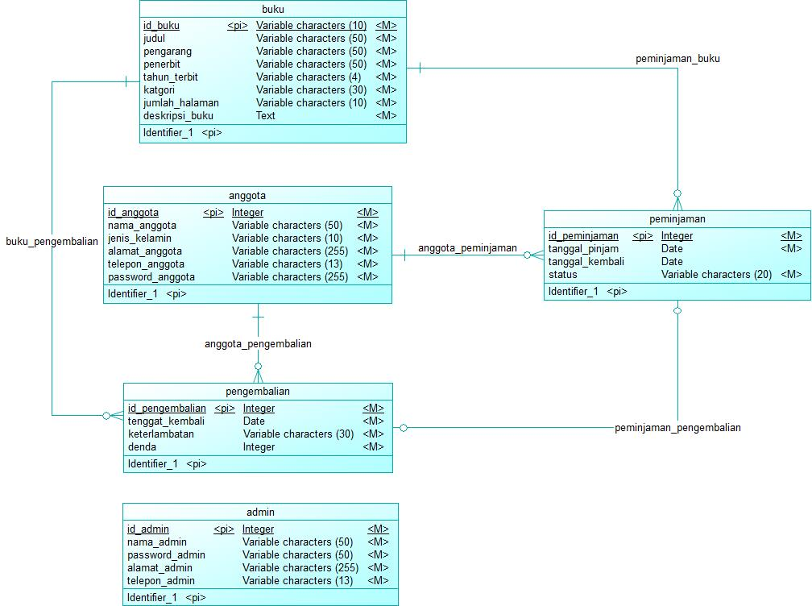
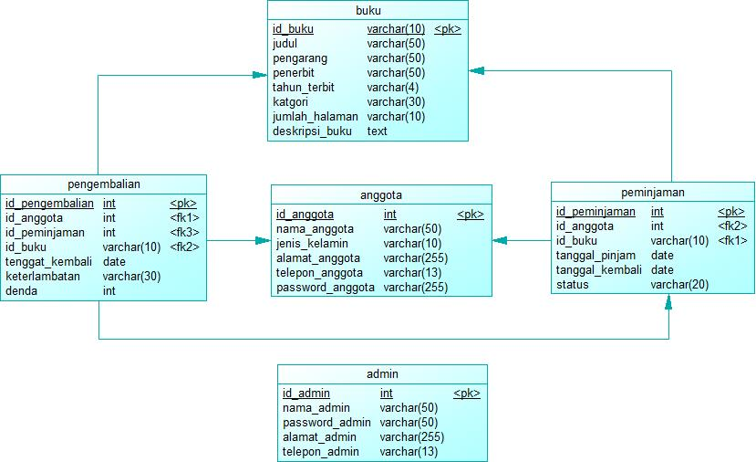
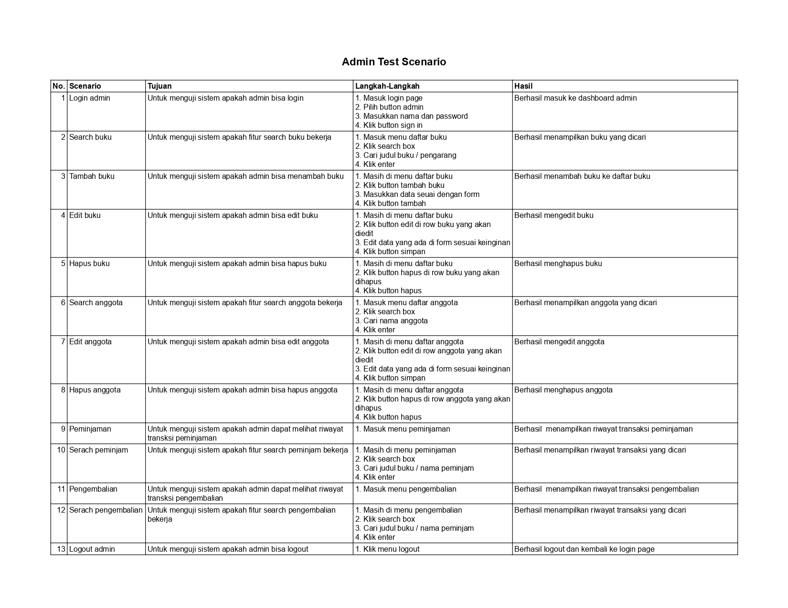
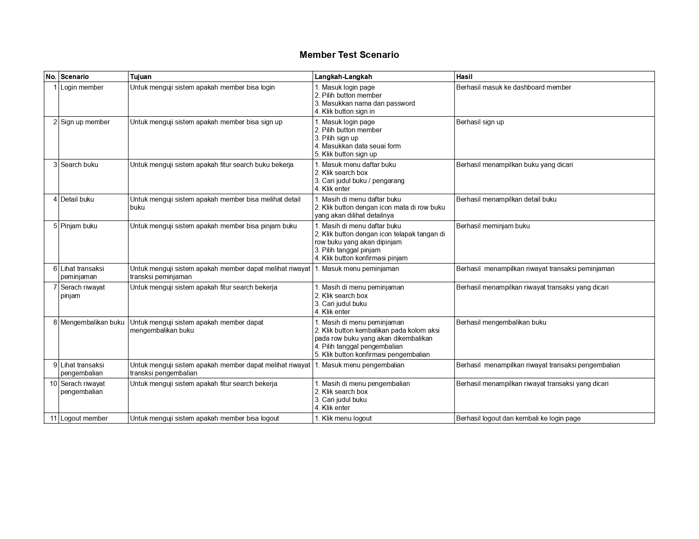

# Website Perpustakaan
Website ini memungkinkan pengguna untuk melihat katalog buku, meminjam buku, dan mengembalikan buku. Untuk sisi admin dapat mengelola katalog buku, daftar anggota, dan mencatat transaksi peminjaman/pengembalian semua pengguna.

## Conceptual Data Model (CDM)
Berikut ini adalah CDM yang digunakan dalam website perpustakaan.

## Physical Data Model (PDM)
Berikut ini adalah PDM yang digunakan dalam website perpustakaan.

## Fitur
1. **Login**
   - Pengguna dapat login sesuai dengan statusnya, yaitu member/admin.
   
2. **Kelola Daftar Buku**
   - Admin dapat melihat daftar buku, mencari buku, menambah buku, mengedit data buku, dan menghapus buku.

3. **Kelola Daftar Anggota**
   - Admin dapat melihat daftar anggota, mencari anggota, mengedit data anggota, dan menghapus anggota.
   
4. **Peminjaman Buku**
   - Member dapat meminjam buku, melihat dan mencari riwayat transaksi peminjamannya sendiri.
   - Admin dapat melihat dan mencari riwayat transaksi peminjaman semua pengguna dan statusnya(dipinjam/dikembalikan).

6. **Pengembalian Buku**
   - Member dapat mengembalikan buku, melihat dan mencari riwayat transaksi pengembaliannya sendiri.
   - Admin dapat melihat dan mencari riwayat transaksi pengembalian semua pengguna

## User Testing Scenario
### Admin
Berikut user testing scenario untuk Admin.

### Member
Berikut user testing scenario untuk Member.

