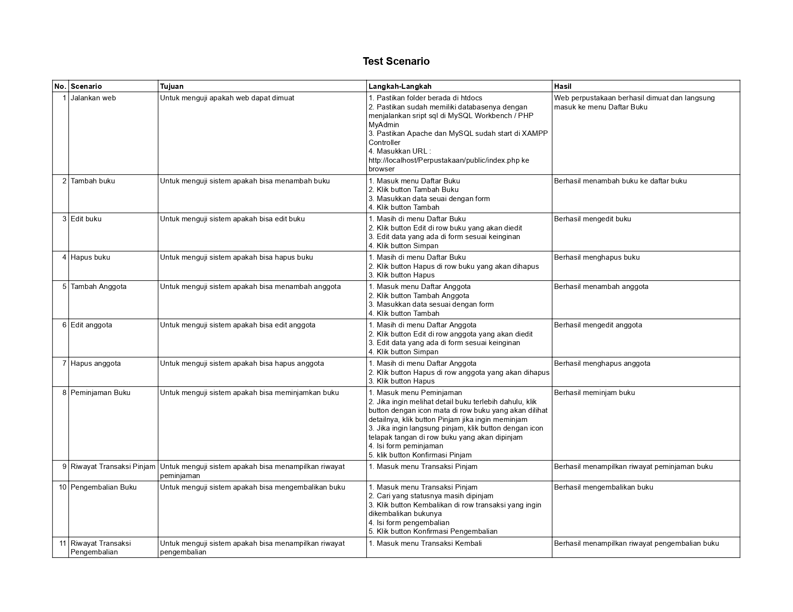

# Website Perpustakaan
Website ini memungkinkan admin dapat mengelola katalog buku, daftar anggota, memproses peminjaman dan pengembalian, serta mencatat transaksi peminjaman/pengembalian semua anggota.

## Conceptual Data Model (CDM)
Berikut ini adalah CDM yang digunakan dalam website perpustakaan.

## Physical Data Model (PDM)
Berikut ini adalah PDM yang digunakan dalam website perpustakaan.

## Class Diagram
Berikut ini adalah Class Diagram yang digunakan dalam website perpustakaan.

## Fitur 

1. **Kelola Daftar Buku**
   - Admin dapat melihat daftar buku, menambah buku, mengedit data buku, dan menghapus buku.

2. **Kelola Daftar Anggota**
   - Admin dapat melihat daftar anggota, menambah anggota, mengedit data anggota, dan menghapus anggota.
   
3. **Peminjaman Buku**
   - Admin dapat melihat katalog buku dan memproses peminjaman buku yang ingin dipinjam oleh anggota.

4. **Pengembalian Buku**
   - Admin dapat memproses pengembalian buku.

5. **Transaksi Pinjam**
   - Admin dapat melihat riwayat transaksi peminjaman anggota.

6. **Transaksi Kembali**
   - Admin dapat melihat riwayat transaksi pengembalian anggota.

## User Testing Scenario

Berikut user testing scenario

Catatan: Folder yang digunakan adalah folder Perpustakaan di dalam folder REVISI, namun pastikan yang dipindah ke htdocs hanya folder Perpustakaan nya saja. Jangan sampai didalam folder REVISI karena akan memengaruhi file location dalam code nya.

